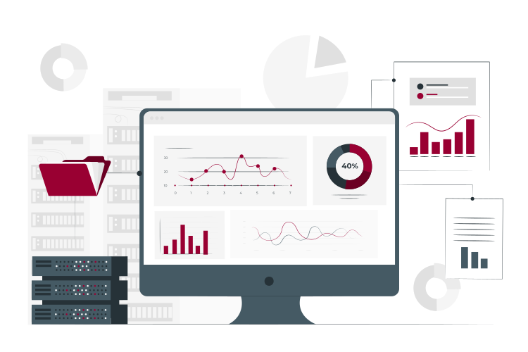

::: {.text-center}
# SDCA's Registers Project Database

{fig-alt="An illustration of a computer screen displaying various data charts, surrounded by servers, folders, and additional charts." width="40em"}

[Getting
started](https://steno-aarhus.github.io/registers-project-database/getting-started/index.html){.btn
.btn-primary role="button"} [How to work with
data](https://steno-aarhus.github.io/registers-project-database/how-to-work-with-data/index.html){.btn
.btn-primary role="button"}

[Statistics
Denmark (DST)](https://steno-aarhus.github.io/registers-project-database/dst/index.html){.btn
.btn-primary role="button"} [Danish Health Data
Authority (DHDA)](https://steno-aarhus.github.io/registers-project-database/sds/index.html){.btn
.btn-primary role="button"}
:::

Image from [Storyset](https://www.storyset.com)
